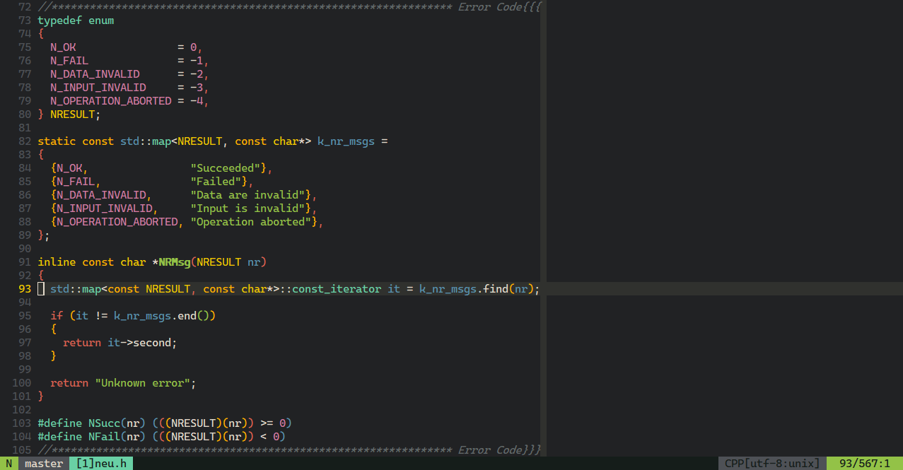

<!------------------------------------------------------------------ HEADER -->
<pre align="center">
  ██╗   ██╗ ████████╗ ██╗   ██╗  ██████╗   ███████╗     ██╗   ██╗ ██████╗ ██╗   ██╗
  ████╗ ██║ ██╔═════╝ ██║   ██║ ██╔═══██╗ ██╔═════╝     ██║   ██║ ╚═██╔═╝ ███╗ ███║
  ██╔██╗██║ ██████╗   ██║   ██║ ██║   ╚═╝ ████████╗     ╚██╗ ██╔╝   ██║   ██╔██╬██║
  ██║╚████║ ██╔═══╝   ██║   ██║ ██║   ██╗ ╚═════██║      ╚████╔╝    ██║   ██║╚═╝██║
  ██║ ╚═██║ ████████╗ ╚██████╔╝ ╚██████╔╝ ███████╔╝ ██╗   ╚██╔╝   ██████╗ ██║   ██║
  ╚═╝   ╚═╝ ╚═══════╝  ╚═════╝   ╚═════╝  ╚══════╝  ╚═╝    ╚═╝    ╚═════╝ ╚═╝   ╚═╝
</pre>

<p align="center">
  <a href="./LICENSE">
    
  </a>
</p>

<p align="center">
  A (Neo)Vim color scheme template.
</p>


<!------------------------------------------------------- TABLE OF CONTENTS -->
<details open="open">
  <summary>Table of Contents</summary>
  <ol>
    <li><a href="#introduction">Introduction</a></li>
    <li>
      <a href="#usage">Usage</a>
      <ul>
        <li><a href="#installation">Installation</a></li>
        <li><a href="#configuration">Configuration</a></li>
        <ul>
          <li><a href="#enable-color-scheme">Enable color scheme</a></li>
          <li><a href="#customize-palette">Customize palette</a></li>
          <li><a href="#choose-color-scheme">Choose color scheme</a></li>
          <li><a href="#use-highlight-groups">Use highlight groups</a></li>
        </ul>
      </ul>
    </li>
    <li><a href="#screenshot">Screenshot</a></li>
    <li><a href="#license">License</a></li>
  </ol>
</details>


<!------------------------------------------------------------ INTRODUCTION -->
## Introduction
`neucs.vim` is more like a color scheme template for (Neo)Vim, instead of a
single color scheme or a color scheme framework, since it allows you to custom
your own palettes for a bunch of pre-defined highlight groups (but you can
still override them).


<!------------------------------------------------------------------- USAGE -->
## Usage
### Installation
Since `neucs.vim` is a plugin instead of a single-file color scheme, you will
need to install it with a plugin manager
(for example [vim-plug](https://github.com/junegunn/vim-plug)):

1. Add `Plug 'Neur1n/neucs.vim'` to init.vim/vimrc
2. Run `:PlugInstall`

### Configuration
#### Enable color scheme
Again, since `neucs.vim` is a plugin instead of a single-file color scheme that
lies in the `colors` folder, putting `colorscheme neucs` before
`Plug 'Neur1n/neucs.vim'` in your init.vim/vimrc might lead to errors due to
(Neo)Vim's loading mechanism (see `:h initialization` ). Therefore you may need
to do this:
```vim
Plug 'Neur1n/neucs.vim'
"
" some configurations...
"
colorscheme neucs
```

#### Customize palette
`neucs.vim` provides a default palette:
```vim
let g:neucs_palettes = {
      \ 'clack': {
        \ 'bgh':    {'c': 234, 'g': '#151d1a'},
        \ 'bgm':    {'c': 235, 'g': '#212224'},
        \ 'bgs':    {'c': 236, 'g': '#30312e'},
        \ 'fgh':    {'c': 252, 'g': '#dad4c4'},
        \ 'fgm':    {'c': 253, 'g': '#e4dbcc'},
        \ 'fgs':    {'c': 254, 'g': '#e5e4df'},
        \ 'grayh':  {'c': 238, 'g': '#3c4041'},
        \ 'graym':  {'c': 239, 'g': '#4e5156'},
        \ 'grays':  {'c': 242, 'g': '#63696a'},
        \ 'red':    {'c': 167, 'g': '#dd6151'},
        \ 'orange': {'c': 214, 'g': '#ffac00'},
        \ 'yellow': {'c': 220, 'g': '#f2c700'},
        \ 'green':  {'c': 107, 'g': '#93c247'},
        \ 'cyan':   {'c':  79, 'g': '#69d0a5'},
        \ 'blue':   {'c':  67, 'g': '#5991ae'},
        \ 'purple': {'c': 175, 'g': '#d37ba2'}
        \ }
      \ }
```
of which colors are picked from the
[SP ABS color codes](https://matrixzj.github.io/docs/sa-keycaps/ColorCodes/).
That's why it is called "clack". Inside the palette dictionary, "c"s are
prepared for 256 colors (see `:h ctermfg`) and "g"s are prepared for GUI colors
(see `:h guifg`).

To add or change a palette, you can modify `g:neucs_palettes` itself or use
`neucs#SetPalette`. In the following example, it adds two palettes to
`g:neucs_palettes`:
- gruvbox: the color scheme from [morhetz/gruvbox](https://github.com/morhetz/gruvbox)
- gruvbox256: a 256-color version of gruvbox made by myself

(256 colors were calculated with
[magarcia/python-x256](https://github.com/magarcia/python-x256).)
```vim
let b:palettes = {
      \ 'gruvbox': {
        \ 'bgh':    {'c': 234, 'g': '#1d2021'},
        \ 'bgm':    {'c': 235, 'g': '#282828'},
        \ 'bgs':    {'c': 236, 'g': '#32302f'},
        \ 'fgh':    {'c': 187, 'g': '#d5c4a1'},
        \ 'fgm':    {'c': 223, 'g': '#ebdbb2'},
        \ 'fgs':    {'c': 230, 'g': '#fbf1c7'},
        \ 'grayh':  {'c':  95, 'g': '#7c6f64'},
        \ 'graym':  {'c': 102, 'g': '#9a8374'},
        \ 'grays':  {'c': 138, 'g': '#a89984'},
        \ 'red':    {'c': 203, 'g': '#fb4934'},
        \ 'orange': {'c': 208, 'g': '#fe8019'},
        \ 'yellow': {'c': 214, 'g': '#fabd2f'},
        \ 'green':  {'c': 142, 'g': '#b8bb26'},
        \ 'cyan':   {'c': 108, 'g': '#8ec07c'},
        \ 'blue':   {'c': 108, 'g': '#83a598'},
        \ 'purple': {'c': 175, 'g': '#d3869b'}
        \ },
      \ 'gruvbox256': {
        \ 'bgh':    {'c': 234, 'g': '#1c1c1c'},
        \ 'bgm':    {'c': 235, 'g': '#262626'},
        \ 'bgs':    {'c': 236, 'g': '#303030'},
        \ 'fgh':    {'c': 222, 'g': '#ffd787'},
        \ 'fgm':    {'c': 223, 'g': '#ffd7af'},
        \ 'fgs':    {'c': 230, 'g': '#ffffd7'},
        \ 'grayh':  {'c': 237, 'g': '#3a3a3a'},
        \ 'graym':  {'c': 239, 'g': '#4e4e4e'},
        \ 'grays':  {'c': 241, 'g': '#626262'},
        \ 'red':    {'c': 203, 'g': '#ff5f5f'},
        \ 'orange': {'c': 208, 'g': '#ff8700'},
        \ 'yellow': {'c': 214, 'g': '#ffaf00'},
        \ 'green':  {'c': 142, 'g': '#afaf00'},
        \ 'cyan':   {'c': 108, 'g': '#87af87'},
        \ 'blue':   {'c': 109, 'g': '#87afaf'},
        \ 'purple': {'c': 175, 'g': '#d787af'}
        \ }
      \ }
call neucs#SetPalette(b:palettes)
```

#### Choose color scheme
When palettes defined, associated colorscheme is defined too (although you are
still using `colorscheme neucs`). To specify a color scheme, use
```vim
let g:neucs_colorscheme = 'a_key_in_g:neucs_palettes'
```
Default palette will be used if `g:neucs_colorscheme` is not specified or
assigned to 'default' or 'clack'.

#### Use highlight groups
`neucs.vim` defines several highlight groups in its own color scheme:
- NeuBgH: darker background color
- NeuBgM: normal background color
- NeuBgS: lighter background color
- NeuFgH: darker foreground color
- NeuFgM: normal foreground color
- NeuFgS: lighter foreground color
- NeuGrayH: darker gray
- NeuGrayM: normal gray
- NeuGrayS: lighter gray
- NeuRed
- NeuOrange
- NeuYellow
- NeuGreen
- NeuCyan
- NeuBlue
- NeuPurple


Use `:hi <group>` (e.g. `:hi NeuRed`) in (Neo)Vim to see what do they look
like. With these highlight groups you can unify the highlighting style easily
in your configurations:
```vim
highlight! link SomePluginGroup1 NeuRed
highlight! link SomePluginGroup2 NeuGreen

highlight! link OtherPluginGroup1 NeuRed
highlight! link OtherPluginGroup2 NeuGreen
```


<!-------------------------------------------------------------- SCREENSHOT -->
## Screenshot
Below is a screenshot of palette "clack" (code snippet
from [neu.h](https://github.com/Neur1n/neucs.vim)).
<p align="center">
  <a href="https://github.com/Neur1n/neu.h">
    
  </a>
</p>


<!----------------------------------------------------------------- LICENSE -->
## License
Distributed under the MIT license. See [LICENSE](LICENSE) for more information.
